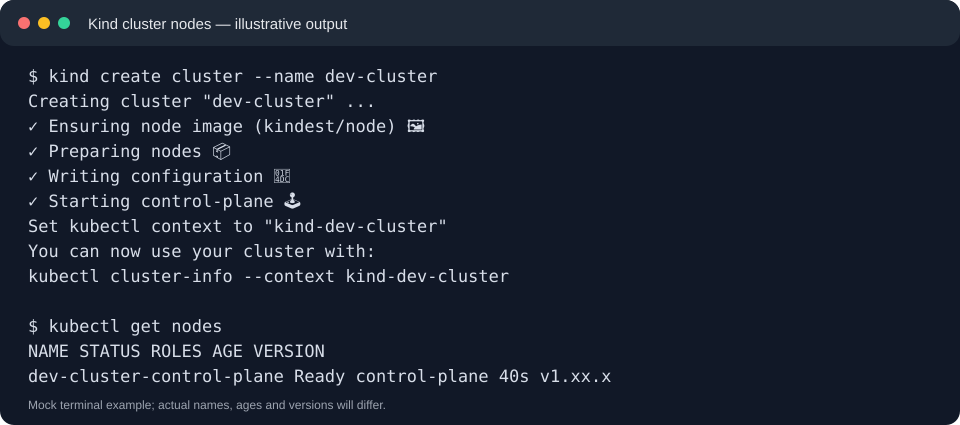
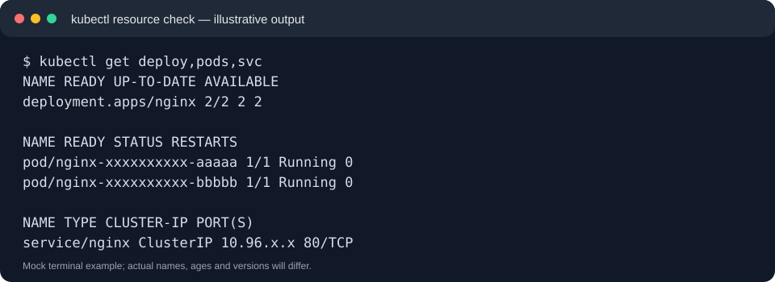
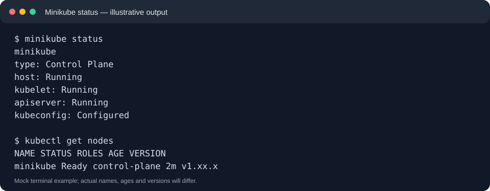

# Kubernetes One-Shot — Hands-on Notes & DevOps Projects

A GitHub-ready, command-by-command Kubernetes learning repository based on the topics covered in the supplied transcript for [Kubernetes In One Shot | 3 Live DevOps Projects | Beginners to Advanced](https://www.youtube.com/watch?v=W04brGNgxN4).

> **Important:** This is an independently written study guide based on the transcript, not an official repository from the video creator. Commands and YAML are reproducible examples; versions and outputs may differ. Screenshots in `screenshots/` are illustrative terminal mockups, not captures from the video.

## Contents

- [Prerequisites](#prerequisites)
- [Choose a local cluster](#choose-a-local-cluster)
- [Repository layout](#repository-layout)
- [Learning guides](#learning-guides)
- [Practice projects](#practice-projects)
- [Screenshot gallery](#screenshot-gallery)
- [Cleanup and cost safety](#cleanup-and-cost-safety)

## Prerequisites

- A computer with 8 GB RAM recommended (16 GB is more comfortable for monitoring/CI-CD labs).
- Git, a terminal, and a code editor.
- Docker Desktop (Windows/macOS) or Docker Engine (Linux) for Kind; virtualization enabled for Minikube drivers.
- `kubectl`; then install **one** local cluster option: Kind or Minikube.
- For advanced sections: Helm; optionally AWS CLI and an AWS account for EKS, plus Jenkins/Argo CD/Prometheus/Grafana when you reach those labs.

Verify basics:

```bash
git --version
docker --version
docker info
kubectl version --client
```

If `docker info` fails, fix Docker first. On Windows, use Docker Desktop with the WSL 2 backend and run commands in PowerShell, Windows Terminal, or a WSL shell consistently.

## Choose a local cluster

| Option | Best for | Guide |
|---|---|---|
| Kind | Fast Kubernetes clusters in Docker; multi-node practice | [Kind installation](docs/01-install-kind.md) |
| Minikube | Beginner-friendly local cluster and dashboard | [Minikube installation](docs/02-install-minikube.md) |
| Managed AWS EKS | Cloud cluster practice; can incur charges | [Cloud and CI/CD overview](docs/10-cloud-cicd.md) |

Do not create both clusters unless you have a reason. Complete the Kind path first, then try Minikube as an alternative.

## Repository layout

```text
kubernetes-one-shot/
├── README.md
├── docs/                         # Step-by-step command guides
├── manifests/                    # Reusable Kubernetes YAML
│   ├── workloads/
│   ├── networking/
│   ├── storage/
│   └── security/
├── projects/voting-app/           # Small practice workload
├── scripts/                       # Helper commands
└── screenshots/                   # Illustrative terminal output images
```

## Learning guides

1. [Install Kind and create a multi-node cluster](docs/01-install-kind.md)
2. [Install Minikube](docs/02-install-minikube.md)
3. [kubectl and cluster inspection](docs/03-kubectl-basics.md)
4. [Core workloads: Pods, Deployments, ReplicaSets, Jobs, CronJobs, DaemonSets, StatefulSets](docs/04-workloads.md)
5. [Services, DNS, Ingress and networking](docs/05-networking.md)
6. [ConfigMaps, Secrets and persistent storage](docs/06-config-storage.md)
7. [Requests, limits, probes and autoscaling](docs/07-health-resources-scaling.md)
8. [RBAC and service accounts](docs/08-rbac.md)
9. [Helm and package management](docs/09-helm.md)
10. [Cloud, CI/CD, GitOps and monitoring overview](docs/10-cloud-cicd.md)
11. [Troubleshooting checklist](docs/11-troubleshooting.md)

## Practice projects

### Project A — Deploy an NGINX web app

```bash
kubectl apply -f manifests/workloads/nginx-deployment.yaml
kubectl apply -f manifests/networking/nginx-service.yaml
kubectl get deploy,pods,svc
kubectl port-forward service/nginx 8080:80
```

Open `http://localhost:8080`, then press `Ctrl+C` to stop port-forwarding.

### Project B — Voting-app practice

A minimal, deliberately simple NGINX-based starter is included in `projects/voting-app/`. It is **not** the full multi-service voting application shown in the video. Use it to practise manifests, services, and port forwarding; build the full frontend/backend/database stack only after understanding networking and persistence.

```bash
kubectl apply -f projects/voting-app/
kubectl get all -n voting-demo -l app=voting-demo
kubectl port-forward service/voting-demo 8081:80
```

Open `http://localhost:8081`.

### Project C — Monitoring and delivery

Follow [Cloud, CI/CD, GitOps and monitoring](docs/10-cloud-cicd.md). The transcript mentions EKS, Jenkins, Argo CD, MongoDB, Prometheus, and Grafana. Those production-style components need their own configuration and may require cloud resources; the guide gives a safe learning sequence rather than pretending one command deploys the complete video environment.

## Publish this folder to GitHub

Create an empty repository on GitHub, then run these commands from this folder (replace the URL with your repository URL):

```bash
git init
git add .
git commit -m "Add Kubernetes hands-on learning guide"
git branch -M main
git remote add origin https://github.com/<your-username>/<your-repository>.git
git push -u origin main
```

Review files before pushing. Never commit kubeconfig files, cloud credentials, private keys, or real Secret values.

## Screenshot gallery

The screenshots are illustrative expected-output examples to show how terminal results can be documented in a README. Re-run the commands in your environment and replace them with your own captures for an accurate project portfolio.





## Cleanup and cost safety

Local Kind cleanup:

```bash
kind delete cluster --name dev-cluster
```

Minikube cleanup:

```bash
minikube stop
# Optional: removes the local cluster and its local data
minikube delete
```

For EKS, EC2, load balancers, disks, NAT gateways, and other cloud resources can cost money even when you are not actively using them. Follow the cloud guide's cleanup checklist and verify resources in your cloud console before finishing.

## License / attribution

These notes are an independent learning companion based on the topics in the supplied video transcript. The video and its original presentation belong to their creator. Kubernetes commands and manifests here are provided for educational use.
